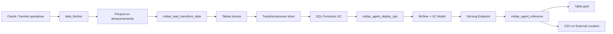
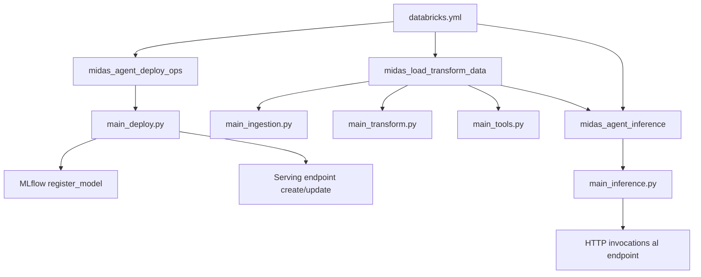
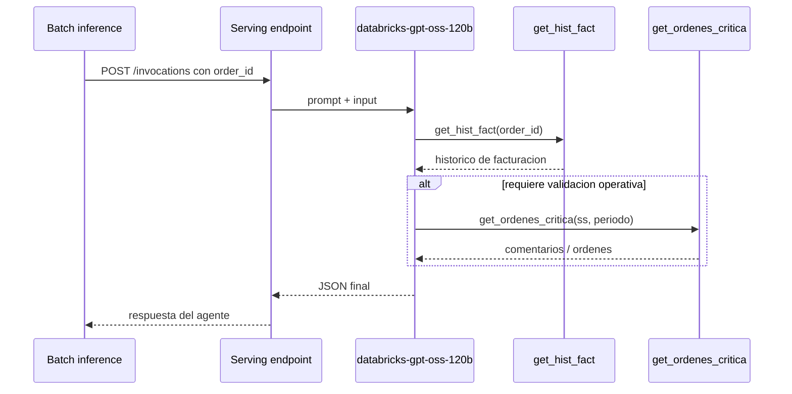
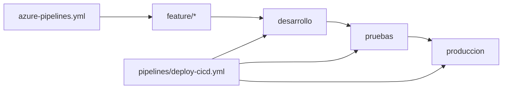

# Arquitectura y flujos

## Vista general
MIDAS no es solo un agente. Es una cadena completa:
1. extraccion Oracle -> parquet
2. ingesta parquet -> tablas bronze
3. transformacion bronze -> silver
4. creacion de SQL Functions
5. despliegue del agente a un serving endpoint
6. inferencia batch
7. publicacion de resultados

## Arquitectura end to end

## Arquitectura logica del bundle

## Flujo funcional del agente

## Flujo por ambientes

## Componentes operativos

### Extraccion
- `data_fetcher/main.py`
- Usa credenciales Oracle por `.env`
- Genera archivos parquet locales

### Ingestion
- `src/midas/main_ingestion.py`
- Carga parquet a tablas bronze
- Garantiza schema destino

### Transformacion
- `src/midas/main_transform.py`
- Construye tablas silver a partir de bronze

### Tools
- `src/midas/main_tools.py`
- Registra funciones SQL en UC

### Deploy del agente
- `src/midas/main_deploy.py`
- Registra modelo en MLflow/UC
- Crea o actualiza endpoint

### Inference batch
- `src/midas/main_inference.py`
- Invoca el endpoint por HTTP
- Escribe Delta y CSV

## Programacion y periodicidad

### Programacion activa
`midas_load_transform_data`:
- cron: `0 30 8 * * ?`
- timezone: `America/Bogota`
- estado: `UNPAUSED`

### Encadenamiento
`midas_load_transform_data` termina disparando `midas_agent_inference` via `run_job_task`.

### Ejecucion por pipeline
`midas_agent_deploy_ops` corre desde Azure DevOps despues del `bundle deploy`.

## Decisiones de diseno relevantes

### Root path compartido
Se usa `/Shared/bundles/${bundle.name}/${bundle.target}` para evitar dependencia de carpetas personales.

### Cluster por job
Se usa `new_cluster` compartido por el bundle en vez de `existing_cluster_id`, para facilitar UAT/PROD y desacoplar el flujo de un cluster manual.

### Endpoint versionado en DEV
El endpoint de DEV quedo como `agente_ordenes_calidad_dev_v3` por conflictos previos de permisos con endpoints heredados.

## Autocritica de arquitectura
- La arquitectura operativa esta funcional, pero no completamente homogenea entre ambientes.
- `main_deploy.py` conserva un workaround de compatibilidad con `databricks-sdk` en lugar de un flujo limpio y definitivo con `databricks.agents`.
- PROD no esta listo como ambiente real; aun contiene placeholders de catalogo y storage.
