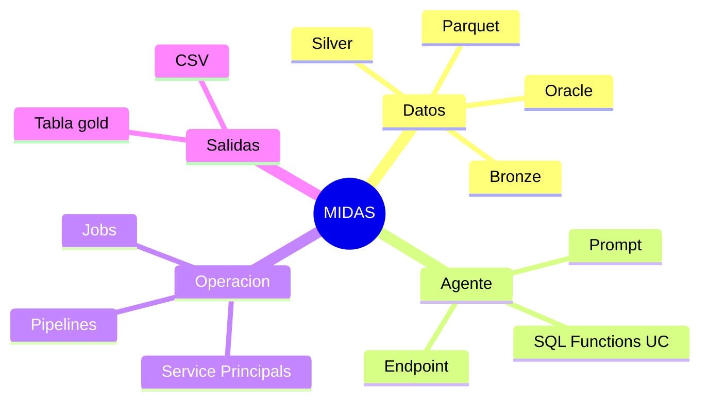

# Transferencia de conocimiento

## Objetivo
Servir como guia de entrega tecnica a la persona o equipo que operara MIDAS despues del handover.

## Que debe entender el receptor
1. que problema resuelve MIDAS
2. como se ejecuta el pipeline de datos
3. como se despliega el agente
4. donde estan las credenciales
5. que partes son estables y que partes son deuda tecnica

## Resumen funcional
MIDAS analiza ordenes de calidad de facturacion, consulta historico y ordenes relacionadas por medio de SQL Functions de Unity Catalog, y devuelve una decision JSON:
- `SIN AJUSTE`
- `CON AJUSTE`
- `INVESTIGACION MANUAL REQUERIDA`

## Resumen tecnico

## Lista de componentes que debe conocer

### Obligatorios
- `databricks.yml`
- `pipelines/deploy-cicd.yml`
- `azure-pipelines.yml`
- `src/midas/main_ingestion.py`
- `src/midas/main_transform.py`
- `src/midas/main_tools.py`
- `src/midas/main_deploy.py`
- `src/midas/main_inference.py`
- `agent/agent.py`
- `src/midas/agent/tools.py`
- `src/midas/agent/prompts.py`
- `tests/manual_endpoint_smoke.py`

### Contexto adicional
- `data_fetcher/`
- `BUGS_TRAZABILIDAD.md`

## Secuencia sugerida de handover
1. explicar arquitectura end to end
2. mostrar `databricks.yml`
3. mostrar pipeline CD
4. mostrar smoke test del endpoint
5. explicar credenciales y owners
6. explicar deuda tecnica actual
7. revisar runbook de soporte

## Checklist para aceptar la transferencia

### Operacion
- [ ] entiende el flujo de carga diaria
- [ ] sabe ejecutar `bundle validate`
- [ ] sabe ejecutar `bundle deploy`
- [ ] sabe correr `midas_agent_deploy_ops`
- [ ] sabe correr `tests/manual_endpoint_smoke.py`

### Accesos
- [ ] tiene acceso al repo
- [ ] tiene acceso al workspace requerido
- [ ] conoce quien administra Azure DevOps Library
- [ ] conoce quien rota secrets

### Soporte
- [ ] sabe leer logs de jobs
- [ ] sabe leer logs del endpoint
- [ ] conoce errores recurrentes y su significado

### Riesgos conocidos
- [ ] entiende que `main_deploy.py` usa un workaround temporal
- [ ] entiende que PROD aun no esta habilitado
- [ ] entiende que hay pruebas desfasadas

## Que no debe asumir el receptor
- que PROD esta listo solo porque existe el target
- que toda la suite de tests refleja el runtime actual
- que UAT/PROD funcionaran igual que DEV sin validar permisos y credenciales

## Recomendaciones para el siguiente responsable
1. alinear `main_deploy.py` con un flujo definitivo de `databricks.agents` cuando el entorno lo soporte
2. actualizar `tests/test_deploy.py` y `tests/test_inference.py`
3. homologar instalacion de Terraform entre CI y CD
4. cerrar configuracion real de PROD en `databricks.yml`

## Autocritica final
- La solucion ya es operable, pero no esta todavia en su forma mas simple ni mas robusta.
- El mayor riesgo no es el algoritmo del agente; es la operacion por ambientes, credenciales y dependencias de plataforma.
- La transferencia sera impecable solo si se entrega junto con accesos reales, no solo con codigo y documentos.
