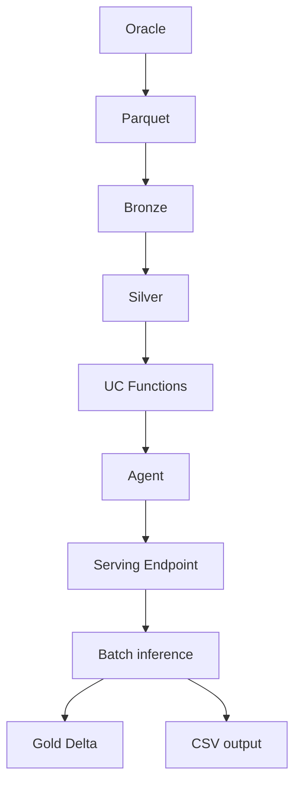

# Manual tecnico

## Objetivo
Describir la solucion MIDAS desde el punto de vista de implementacion, despliegue, componentes y contratos tecnicos. Este documento esta pensado para ingenieros, DevOps y responsables de mantenimiento.

## 1. Alcance tecnico
La solucion implementa:
- extraccion externa de datos desde Oracle a parquet
- procesamiento batch en Databricks con Databricks Asset Bundles
- registro de funciones SQL en Unity Catalog
- despliegue de un agente LLM sobre Serving
- inferencia batch con persistencia en tabla Delta y publicacion CSV

No cubre:
- interfaz de usuario final
- observabilidad corporativa centralizada
- productivizacion completa del ambiente PROD

## 2. Contrato de arquitectura



## 3. Componentes tecnicos

### 3.1 `data_fetcher/`
Responsabilidad:
- extraer datos de Oracle
- materializar parquet local

Entradas:
- `DB_USER`
- `DB_PASSWORD`
- `DB_DSN`
- opcional `ORACLE_CLIENT_LIB_DIR`

Salidas:
- parquet bajo `data_fetcher/data/` en ejecucion local

Observacion:
- no forma parte del bundle Databricks
- es un paso previo de generacion de insumos

### 3.2 `src/midas/main_ingestion.py`
Responsabilidad:
- leer parquet fuente desde Volumes
- crear/cargar tablas bronze

Entradas CLI:
- `--source_catalog`
- `--source_schema`
- `--source_volume`
- `--source_base_path`
- `--destination_catalog`
- `--destination_schema`

Tablas bronze esperadas:
- `midas_ordenes_calidad_pendientes_bronze`
- `midas_datos_basicos_producto_bronze`
- `midas_datos_lecturas_producto_bronze`
- `midas_datos_consumos_producto_bronze`
- `midas_datos_ordenes_previa_critica_bronze`
- `midas_datos_cometarios_ordenes_bronze`
- `midas_datos_cuentas_cobro_bronze`
- `midas_datos_detalle_cargos_bronze`

### 3.3 `src/midas/main_transform.py`
Responsabilidad:
- transformar bronze a silver

Tablas silver relevantes:
- `midas_ordenes_calidad_pendientes_silver`
- `midas_historial_facturacion_silver`
- `midas_datos_basicos_producto_silver`
- `midas_historial_critica_silver`

### 3.4 `src/midas/main_tools.py`
Responsabilidad:
- crear las funciones SQL que el agente usara como herramientas

Funciones creadas:
- `get_hist_fact(order_id)`
- `get_ordenes_critica(serv_suscrito, periodo_consumo)`

### 3.5 `agent/agent.py`
Responsabilidad:
- implementar el ResponsesAgent servido por Databricks
- resolver tool calling contra Unity Catalog

Elementos clave:
- modelo base: `databricks-gpt-oss-120b`
- prompt de negocio importado desde `src/midas/agent/prompts.py`
- coercion de enteros en string hacia `int` antes de ejecutar UC Functions

### 3.6 `src/midas/main_deploy.py`
Responsabilidad:
- registrar el agente en MLflow
- registrar version en Unity Catalog
- crear o actualizar el endpoint de serving

Punto critico:
- usa workaround con `databricks-sdk`
- no representa el camino definitivo ideal de largo plazo

### 3.7 `src/midas/main_inference.py`
Responsabilidad:
- invocar el endpoint por HTTP desde Spark
- persistir resultados
- publicar CSV

Caracteristicas:
- timeout base de 300 segundos
- hasta 3 intentos con backoff
- salida append en tabla Delta
- genera un unico CSV final por corrida

## 4. Bundle y contratos por ambiente

### DEV
- workspace host definido
- endpoint: `agente_ordenes_calidad_dev_v3`
- `run_as` comentado para permitir despliegue manual

### UAT
- workspace host definido
- `run_as` con SP UAT
- endpoint: `agente_ordenes_calidad_uat`

### PROD
- target declarado, pero no listo
- placeholders en catalogos y storage

## 5. Jobs del bundle

### `midas_load_transform_data`
Secuencia:
1. ingestion
2. transform
3. tools
4. trigger inference

Frecuencia:
- diaria 08:30 America/Bogota

### `midas_agent_deploy_ops`
Uso:
- despliegue / actualizacion del agente
- invocado por pipeline tras `bundle deploy`

### `midas_agent_inference`
Uso:
- ejecucion batch del endpoint
- escribe tabla y CSV

## 6. Pipelines

### CI - `azure-pipelines.yml`
Incluye:
- instalacion dependencias de test
- pytest y coverage
- SonarQube
- despliegue DEV para `feature/*`

Limitacion:
- no instala Terraform explicitamente

### CD - `pipelines/deploy-cicd.yml`
Incluye:
- deploy manual a DEV
- deploy automatico/manual a UAT
- PROD bloqueado
- instalacion explicita de Terraform 1.5.5

## 7. Contratos de entrada y salida

### Entrada del endpoint
Payload esperado:
```json
{
  "input": [
    {
      "role": "user",
      "content": "629221960"
    }
  ]
}
```

### Salida del endpoint
JSON final esperado:
```json
{
  "order_id": "629221960",
  "decision": "CON AJUSTE | SIN AJUSTE | INVESTIGACION MANUAL REQUERIDA",
  "justification": "Texto de soporte"
}
```

### Salida batch
- tabla Delta gold
- CSV final en external location

## 8. Dependencias tecnicas criticas

### Databricks CLI v2
Requerido para:
- bundle validate
- bundle deploy
- bundle run

### Terraform 1.5.5
Requerido por Databricks CLI bundle commands.

### MLflow / databricks-sdk
Critico para deploy del agente y serving.

### Requests
Usado en inferencia batch para invocacion HTTP del endpoint.

## 9. Troubleshooting tecnico

### Caso: bundle validate falla descargando Terraform
Verificar:
- acceso del agent pool a `releases.hashicorp.com`
- step `Install Terraform`
- variable `DATABRICKS_TF_EXEC_PATH`

### Caso: UAT falla con `AADSTS7000215`
Conclusión:
- el problema es el client secret del SP, no el codigo del repo

### Caso: endpoint responde timeout
Verificar:
- cold start
- workload size
- scale to zero
- latencia de tools

### Caso: smoke test local falla
Verificar:
- `databricks auth env`
- host correcto
- permiso al endpoint

## 10. Deuda tecnica priorizada
1. unificar deploy del agente con un mecanismo definitivo
2. actualizar tests de deploy e inference
3. homologar Terraform entre CI y CD
4. cerrar configuracion real de PROD

## 11. Autocritica tecnica
- El sistema es operable, pero aun no es minimalista.
- La parte mas fragil esta en despliegue y plataforma, no en la logica de negocio.
- La entrega tecnica debe ir acompañada de ownership claro sobre pipelines, SPs y accesos.
