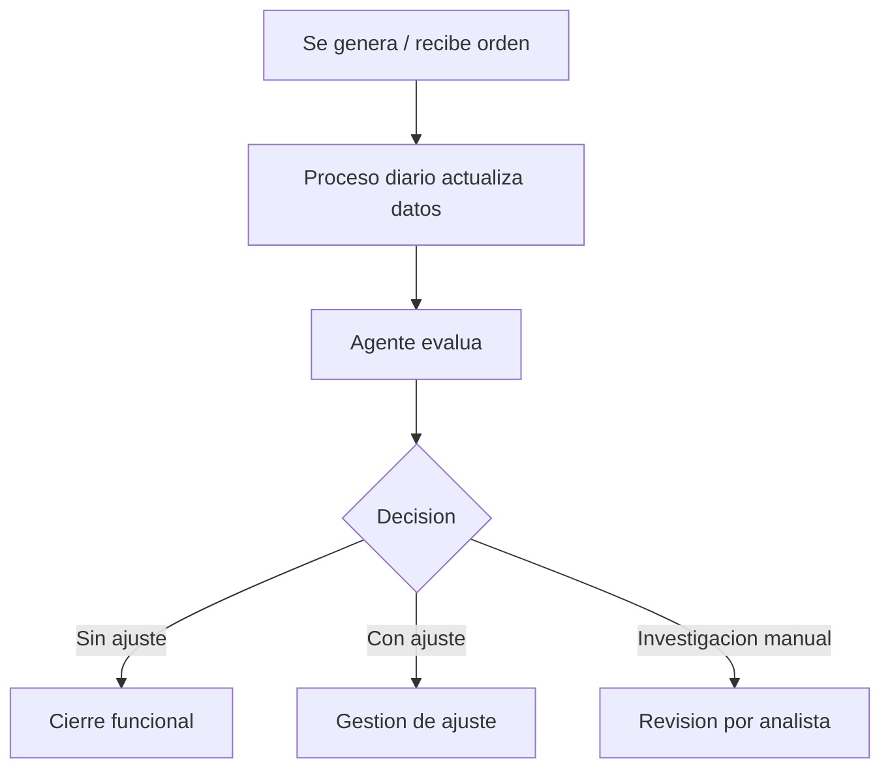

# Manual de usuario

## Objetivo
Explicar la solucion MIDAS a una persona que la va a consultar, operar funcionalmente o interpretar resultados, sin exigirle conocimiento profundo de Databricks.

## 1. Que hace MIDAS
MIDAS analiza ordenes de calidad de facturacion para identificar si:
- no requieren ajuste
- requieren ajuste
- necesitan investigacion manual

La decision se apoya en:
- historico de facturacion
- consumos
- planes de facturacion
- ordenes de critica y comentarios relacionados

## 2. Que entra al sistema
La unidad minima de analisis es una `orden`.

El sistema trabaja sobre datos cargados previamente y el endpoint recibe, conceptualmente, un identificador de orden.

## 3. Que entrega el sistema
MIDAS devuelve un JSON con:
- `order_id`
- `decision`
- `justification`

## 4. Como interpretar la salida

### `SIN AJUSTE`
No se identifica una inconsistencia que obligue a corregir la orden.

### `CON AJUSTE`
Se detecta una condicion que justifica ajuste o nivelacion entre acueducto y alcantarillado.

### `INVESTIGACION MANUAL REQUERIDA`
La informacion no permite una conclusion automatica segura.

## 5. Frecuencia de ejecucion
- La carga principal corre diariamente a las 08:30 hora Bogota.
- El despliegue del agente no es diario; solo corre cuando hay cambios de codigo o configuracion.

## 6. Donde ver resultados

### Resultado online
En el endpoint de serving del ambiente correspondiente.

### Resultado batch
En:
- tabla gold en Databricks
- CSV publicado en external location

## 7. Que puede hacer un usuario funcional
- validar decisiones generadas
- contrastar casos con el historico
- escalar inconsistencias al equipo tecnico

## 8. Que no debe hacer un usuario funcional
- cambiar credenciales o variables de entorno
- desplegar codigo sin acompañamiento tecnico
- asumir que un caso manual es un error del sistema; puede ser una condicion deliberada de seguridad

## 9. Flujo de uso recomendado

## 10. Cuando escalar
Escalar si:
- el endpoint no responde
- hay errores repetidos en la corrida diaria
- el CSV final no se publica
- se observan decisiones inconsistenes frente a evidencia operacional

## 11. FAQ funcional

### Si una orden sale en investigacion manual, el sistema fallo?
No necesariamente. Puede ser la salida correcta cuando no hay soporte suficiente para automatizar la decision.

### El sistema reemplaza al analista?
No. El sistema asiste y acelera decisiones repetibles, pero no elimina la revision humana en casos ambiguos.

### La justificacion siempre sera identica?
No. La decision debe ser consistente; la redaccion puede variar ligeramente segun el modelo.

## 12. Autocritica funcional
- El sistema es entendible para operacion, pero no tiene una interfaz de usuario dedicada.
- La interpretacion de resultados sigue dependiendo de conocimiento funcional del proceso de facturacion.
- Para negocio, el mayor valor esta en reducir el volumen de revision, no en eliminar la necesidad de juicio experto.
