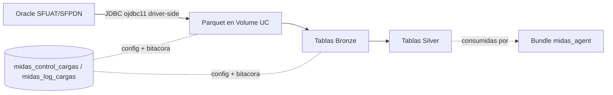
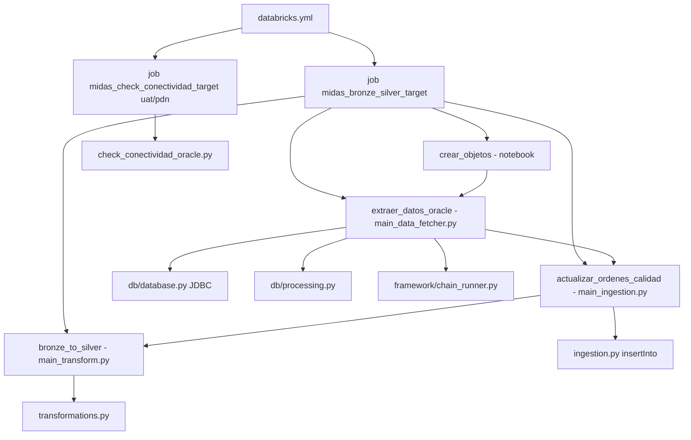
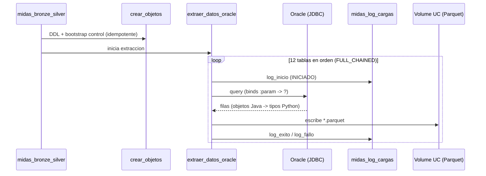
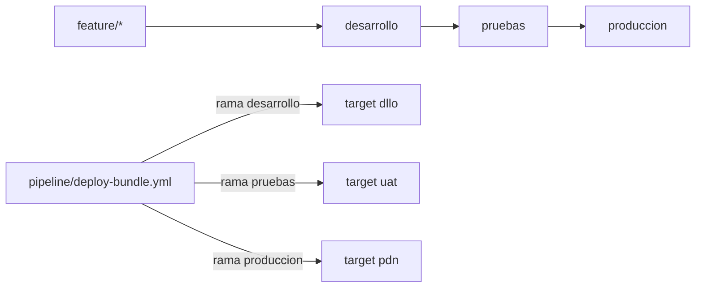

# Arquitectura y flujos

## Vista general
`midas_data_platform` es una cadena de datos batch. Un solo job diario ejecuta, en
orden, cuatro tasks:
1. creacion/siembra idempotente del plano de control
2. extraccion Oracle -> Parquet (JDBC)
3. ingesta Parquet -> Bronze
4. transformacion Bronze -> Silver

El resultado (Silver) lo consume el bundle `midas_agent`. Este bundle **no** crea
funciones SQL, **no** despliega agente y **no** ejecuta inferencia.

## Arquitectura end to end

## Arquitectura logica del bundle

## Flujo de la cadena de extraccion

## Flujo por ambientes

## Componentes operativos

### 0. Creacion de objetos
- `notebooks/00_creacion_objetos_midas.py` (task `crear_objetos`)
- Idempotente: DDL `IF NOT EXISTS` de control/log/parametros + bootstrap de los DOS
  `job_name` (12 cargas Bronze + 13 objetos Silver) + migraciones guardadas + verificacion
- Es la primera task; sin ella el resto no tiene metadata para operar

### 1. Extraccion
- `src/midas/main_data_fetcher.py` + `src/midas/db/*`
- Conexion JDBC driver-side; escribe Parquet en el Volume
- Registra cada paso en el plano de control con `job_name = 'midas_bronze'`

### 2. Ingestion
- `src/midas/main_ingestion.py` + `ingestion.py`
- Carga Parquet a las 12 tablas Bronze con `insertInto(overwrite=True)`

### 3. Transformacion
- `src/midas/main_transform.py` + `transformations.py`
- Construye las 4 tablas Silver a partir de Bronze

### Diagnostico (on-demand)
- `notebooks/check_conectividad_oracle.py` (job `midas_check_conectividad`, uat/pdn)
- Valida DNS -> TCP -> jar -> `SELECT 1 FROM DUAL` antes de correr la cadena

## Programacion y periodicidad

### Programacion activa
`midas_bronze_silver_<target>`:
- cron: `0 0 7 * * ?`
- timezone: `America/Bogota`
- estado: `PAUSED` (dllo) / `UNPAUSED` (uat, pdn)

### Encadenamiento entre bundles
No hay `run_job_task` entre bundles. El contrato es temporal: la cadena termina antes
de las ~08:00 y la inferencia de `midas_agent` debe correr despues (o validar
`midas_log_cargas` de la corrida del dia).

## Decisiones de diseno relevantes

### Conector JDBC en lugar de driver Python
La cuenta Oracle de PROD usa verificador de contraseña 10G, no soportado por el modo
thin del driver Python (`DPY-3015`). ojdbc11 si lo soporta. Ver manual tecnico.

### JDBC driver-side, no Spark JDBC
En clusters Unity Catalog, `spark.read.format("jdbc")` exige `SELECT ON ANY FILE`
(`42501`). JayDeBeApi corre como codigo plano en el driver y no es interceptado por UC.

### Runtime unico 16.4 (JDK 17)
El jar ojdbc11 requiere JDK 11+/17. Un runtime en JDK 8 produce SIGSEGV (exit 139) al
levantar la JVM de JPype. Por eso los tres targets usan `16.4.x-scala2.12`.

### Cluster por ambiente
- dllo: `existing_cluster_id` (el SP no puede crear clusters).
- uat/pdn: `job_clusters` efimeros `SINGLE_USER` con `single_user_name = SP`.
- NINGUN target declara `libraries`: por restriccion de plataforma EPM no se pueden
  instalar libs a nivel de cluster (igual que `vera_framework`). El driver JDBC se
  instala por `%pip` en la primera celda del notebook de extraccion.

### Extraccion como notebook_task (no spark_python_task)
Consecuencia de lo anterior: `extraer_datos_oracle` es un `notebook_task`
(`notebooks/10_extraer_datos_oracle.py`) porque un `spark_python_task` no puede
ejecutar `%pip` y fallaria con `ModuleNotFoundError: No module named 'jaydebeapi'`.
El notebook es un wrapper delgado: instala el driver y llama a
`main_data_fetcher.main()` (la logica de extraccion NO se duplica). Las demas tasks
de la cadena no usan Oracle y siguen siendo `spark_python_task`.

### crear_objetos como primera task
Patron validado por `vera_framework`: un solo mecanismo canonico e idempotente crea/siembra
el control. Reemplaza el seed manual en SQL.

## Autocritica de arquitectura
- La arquitectura es homogenea entre ambientes, salvo el modo de cluster (heredado de restricciones de plataforma en dllo).
- La cadena trae todo a memoria del driver (`fetchall`); es apta para volumenes pequeños/medianos filtrados. Volumenes grandes exigirian paginacion.
- El acoplamiento con `midas_agent` es temporal (schedule), no un contrato de datos fuerte; conviene formalizarlo con una validacion sobre `midas_log_cargas`.
