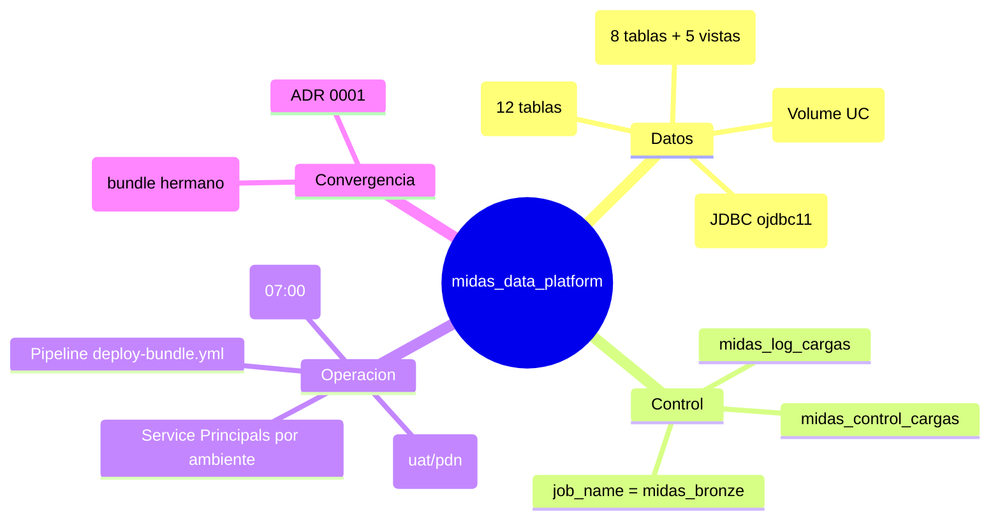

# Transferencia de conocimiento

## Objetivo
Guia de entrega tecnica al equipo que operara `midas_data_platform` despues del handover.

## Que debe entender el receptor
1. que produce el bundle (Bronze y Silver) y para quien (bundle `midas_agent`)
2. como corre la cadena diaria y sus 4 tasks
3. por que la conexion a Oracle es JDBC driver-side y no otra cosa
4. donde estan las credenciales y los prerrequisitos de plataforma
5. que es estable y que es deuda tecnica

## Resumen funcional
El bundle extrae 8 conjuntos de datos de facturacion desde Oracle, los deja como
Parquet, los carga a Bronze y los transforma a 4 tablas Silver. No decide nada de
negocio: esa logica (agente) esta en `midas_agent`.

## Resumen tecnico

## Lista de componentes que debe conocer

### Obligatorios
- `databricks.yml`
- `pipeline/deploy-bundle.yml`
- `notebooks/00_creacion_objetos_midas.py`
- `notebooks/check_conectividad_oracle.py`
- `src/midas/db/database.py`
- `src/midas/db/processing.py`
- `src/midas/framework/control_cargas.py`
- `src/midas/framework/chain_runner.py`
- `src/midas/ingestion.py`
- `src/midas/transformations.py`
- `src/midas/main_data_fetcher.py`, `main_ingestion.py`, `main_transform.py`

### Contexto adicional
- `docs/adr/0001-bundles-separados-vera-midas.md`
- `BUGS_TRAZABILIDAD.md`
- Repo de referencia `vera_framework` (solo lectura)

## Secuencia sugerida de handover
1. explicar la cadena end-to-end hasta Silver y el contrato con `midas_agent`
2. mostrar `databricks.yml` (targets, job de 4 tasks, cluster por ambiente)
3. explicar el conector JDBC (por que ojdbc, por que driver-side, runtime 16.4)
4. mostrar el plano de control y el rol de `job_name`
5. explicar credenciales, GRANTs, jar en Volume y apertura de red
6. mostrar `midas_check_conectividad` como herramienta de diagnostico
7. revisar deuda tecnica y el runbook de soporte

## Checklist para aceptar la transferencia

### Operacion
- [ ] entiende el flujo de la cadena diaria y sus 4 tasks
- [ ] sabe ejecutar `bundle validate` / `deploy` / `run`
- [ ] sabe correr `midas_check_conectividad`
- [ ] sabe leer `midas_log_cargas` para diagnosticar

### Accesos
- [ ] tiene acceso al repo y al workspace requerido
- [ ] conoce quien administra Azure DevOps Library y los SPs
- [ ] conoce quien administra GRANTs de UC, el jar del Volume y la red hacia Oracle

### Soporte
- [ ] sabe distinguir fallo de red vs credenciales vs GRANT vs runtime
- [ ] conoce la tabla de diagnostico (doc 05 y 07)

### Riesgos conocidos
- [ ] entiende el test stale de `test_ingestion`
- [ ] entiende que uat/pdn dependen de red + jar + GRANTs (no solo credenciales)
- [ ] entiende la divergencia deliberada int/float vs Decimal respecto a Vera

## Que no debe asumir el receptor
- que uat/pdn funcionaran igual que dllo sin validar red, jar y GRANTs
- que toda la suite de tests esta en verde (hay 1 fallo heredado)
- que puede hacer `bundle destroy` sin afectar el plano de control compartido

## Recomendaciones para el siguiente responsable
1. actualizar el test stale de `test_ingestion`
2. crear el variable group propio `databricks-DATA-PLATFORM`
3. formalizar el contrato con `midas_agent` (precondicion sobre `midas_log_cargas`)
4. planear el renombrado de `source_base_path` cuando haya ventana de migracion

## Autocritica final
- El bundle ya es operable y esta enfocado, pero su punto fragil no es la logica sino la plataforma: red, jar, GRANTs y runtime.
- La entrega sera impecable solo si se acompaña de accesos reales, no solo de codigo y documentos.
- El plano de control compartido exige coordinacion con el equipo de `vera_framework`.
