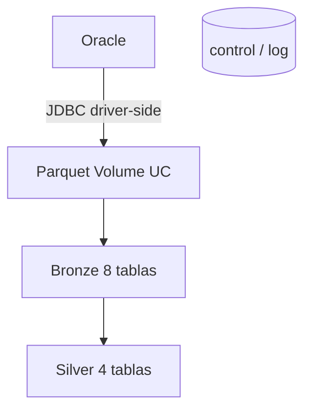

# Manual tecnico

## Objetivo
Describir `midas_data_platform` desde la implementacion, el despliegue, los componentes
y los contratos tecnicos. Pensado para ingenieros de datos, DevOps y mantenimiento.

## 1. Alcance tecnico
La solucion implementa:
- extraccion batch desde Oracle a Parquet usando JDBC ojdbc11 (JayDeBeApi + JPype1)
- carga Parquet -> Bronze (Delta) con `insertInto`
- transformacion Bronze -> Silver (Spark SQL)
- un plano de control compartido (`midas_control_cargas` / `midas_log_cargas`) por `job_name`

No cubre: SQL Functions, agente LLM, serving, inferencia, Gold ni CSV (viven en `midas_agent`).

## 2. Contrato de arquitectura

## 3. Componentes tecnicos

### 3.1 `src/midas/db/database.py` (conector JDBC)
Responsabilidad: conectar a Oracle y ejecutar queries devolviendo `pandas.DataFrame`.

Interfaz publica (estable): `init_database()`, `execute_query(query, params)`, `close_pool()`.

Variables de entorno: `DB_USER`, `DB_PASSWORD`, `DB_DSN` (`host:puerto/servicio`),
`ORACLE_JDBC_JAR_PATH`.

URL JDBC (espejo de `vera_framework`): `jdbc:oracle:thin:@{host}:{port}/{service}` (sin `//`).

Dos conversiones criticas:
- **binds nombrados**: `queries.py` usa `:param`; JDBC solo entiende `?`. La conversion se
  hace en runtime reemplazando solo los nombres presentes en el dict, repitiendo el valor
  por cada ocurrencia. Los literales tipo `'YYYY-MM-DD HH24:MI:SS'` no se tocan.
- **tipos Java -> Python**: JayDeBeApi devuelve `NUMBER`/`DATE`/`CLOB` como objetos Java.
  Se convierten usando la escala del metadata (`cursor.description[i][5]`):
  scale 0 -> `int`, scale > 0 -> `float`, fecha -> `datetime`, CLOB -> `str`.

> Divergencia deliberada vs Vera (I10): Vera convierte NUMBER con decimales a `Decimal`
> (su BronzeLoader castea despues). Midas mantiene `int`/`float` para no cambiar el schema
> de los Parquet y no romper `insertInto` contra las Bronze existentes.

### 3.2 `src/midas/db/queries.py`
Almacen de queries Oracle con binds nombrados. No se modifica.

### 3.3 `src/midas/db/processing.py`
Ejecuta cada query y escribe su Parquet en el Volume (`OUTPUT_PATH`).

### 3.4 `src/midas/main_data_fetcher.py` (task extraer_datos_oracle)

> **Se invoca desde un `notebook_task`**, no desde `spark_python_task`:
> `notebooks/10_extraer_datos_oracle.py` instala el driver con `%pip` (unico mecanismo
> permitido por la plataforma EPM) y luego llama a `main_data_fetcher.main()` armando
> `sys.argv` desde los `base_parameters`. La logica de abajo NO se duplica.
Entradas CLI: `--db_user`, `--db_dsn`, `--secret_scope`, `--db_password_secret_key`,
`--oracle_jdbc_jar_path`, `--output_path`, `--control_catalog`, `--control_schema`,
`--job_name` (default `midas_bronze`).
Lee la contraseña del secret scope, exporta env vars, arma `sys.path` (patron BUG-001),
crea el `ControlCargasClient` y corre `ejecutar_cadena_extraccion`. Cierra la conexion en `finally`.

Tablas Bronze producidas (8):
- `midas_ordenes_calidad_pendientes_bronze`
- `midas_datos_basicos_producto_bronze`
- `midas_datos_lecturas_producto_bronze`
- `midas_datos_consumos_producto_bronze`
- `midas_datos_ordenes_previa_critica_bronze`
- `midas_datos_cometarios_ordenes_bronze`
- `midas_datos_cuentas_cobro_bronze`
- `midas_datos_detalle_cargos_bronze`

### 3.5 `src/midas/main_ingestion.py` (task actualizar_ordenes_calidad)
Entradas CLI: `--source_catalog/schema/volume/base_path`, `--destination_catalog/schema`,
`--control_catalog/schema`, `--job_name`.
Carga cada Parquet a Bronze con `insertInto(overwrite=True)` (nunca `saveAsTable` con
overwrite ni TRUNCATE sobre tablas existentes: preserva PK/NOT NULL/comentarios). Registra
cada tabla en el log.

### 3.6 `src/midas/main_transform.py` (task bronze_to_silver)
Entradas CLI: `--catalog`, `--schema`. Ejecuta `SilverTransformer`.

Tablas Silver producidas (4):
- `midas_ordenes_calidad_pendientes_silver`
- `midas_historial_facturacion_silver`
- `midas_datos_basicos_producto_silver`
- `midas_historial_critica_silver`

### 3.7 `src/midas/framework/control_cargas.py`
Cliente de `midas_control_cargas` / `midas_log_cargas`. Filtra lecturas por `job_name`.
El log se inserta por columnas explicitas (id_log es IDENTITY). Estados: `INICIADO`,
`EXITOSO`, `FALLIDO`.

### 3.8 `src/midas/framework/chain_runner.py`
Orquestador delgado de las 8 extracciones. Aborta al primer fallo (la cadena es dependiente).

### 3.9 `notebooks/00_creacion_objetos_midas.py` (task crear_objetos)
DDL `IF NOT EXISTS` de control/log (con `job_name` en el CREATE), migracion guardada
(`ALTER ADD COLUMN` si falta), bootstrap MERGE de 8 filas `FULL_CHAINED`
(`job_name='midas_bronze'`), `query_padre_id` y verificacion que hace `raise` si no hay 8
filas activas. No crea Bronze/Silver (eso lo hace `ingestion.py`).

## 4. Bundle y contratos por ambiente

| Elemento | dllo | uat | pdn |
| --- | --- | --- | --- |
| host | adb-1161217326944529.9 | adb-6159907084216583.3 | adb-5768199714870840.0 |
| catalogo destino | epm_datalabs_catalog_dllo | epm_datalake_catalog_np | epm_datalake_catalog_prod |
| cluster | existing_cluster_id | job_cluster SINGLE_USER | job_cluster SINGLE_USER |
| libs JDBC | `%pip` en el notebook de extraccion | idem | idem |
| schedule | PAUSED | UNPAUSED | UNPAUSED |
| Oracle | epm-to34:1521/SFUAT | epm-to34:1521/SFUAT | epm-po34:1522/SFPDN |

Todos los targets: `spark_version = 16.4.x-scala2.12`, `run_as` con SP, root_path
`/Shared/bundles/${bundle.name}/${bundle.target}`.

## 5. Jobs del bundle

### `midas_bronze_silver_<target>`
Secuencia: `crear_objetos -> extraer_datos_oracle -> actualizar_ordenes_calidad -> bronze_to_silver`.
Frecuencia: diaria 07:00 America/Bogota.

### `midas_check_conectividad_<target>` (uat/pdn)
Task `check` (notebook). On-demand, sin schedule. Valida DNS -> TCP -> jar -> `SELECT 1 FROM DUAL`.

## 6. Pipeline `pipeline/deploy-bundle.yml`
- trigger por ramas `desarrollo`/`pruebas`/`produccion` + parametro manual `environment`
- 3 stages independientes `Deploy_DLLO`/`Deploy_UAT`/`Deploy_PDN` (`dependsOn: []`)
- cada stage: checkout -> instalar Databricks CLI -> instalar Terraform 1.9.8 explicito en
  `/tmp/terraform_bin/terraform` -> `bundle validate` -> `bundle deploy`
- env por stage con prefijos `DEV_`/`UAT_`/`PROD_` del variable group `databricks-MIDAS` y
  `DATABRICKS_TF_EXEC_PATH`

## 7. Contratos de entrada y salida

### Entrada
- Oracle (8 queries de `queries.py`) + parametros de conexion y de control.

### Salida
- 8 Parquet en `/Volumes/<source_catalog>/<source_schema>/<source_volume>/<source_base_path>`
- 8 tablas Bronze y 4 tablas Silver en `<catalog_destino>.facturacion`
- filas de bitacora en `midas_log_cargas`

### Contrato de tipos (paridad Parquet, I10)
`NUMBER(p,0)->int`, `NUMBER(p,s>0)/sin escala->float`, `VARCHAR2/CHAR->str`,
`DATE/TIMESTAMP->datetime`, `CLOB->str`, `NULL->None`.

## 8. Dependencias tecnicas criticas
- **Databricks CLI** (validate/deploy/run)
- **Terraform 1.9.8** (instalado explicito en el pipeline; el agent pool falla descargandolo)
- **Runtime 16.4 (JDK 17)** empatado con ojdbc11 (un JDK 8 -> SIGSEGV)
- **JayDeBeApi + JPype1** (driver JDBC)
- **jar ojdbc11 en el Volume** (`READ VOLUME` del SP)

## 9. Troubleshooting tecnico

### bundle validate/deploy falla descargando Terraform
Verificar acceso del agent pool a `releases.hashicorp.com`, el step Install Terraform y
`DATABRICKS_TF_EXEC_PATH`.

### Extraccion falla con timeout (DPY-6005)
Es red, no credenciales. Correr `midas_check_conectividad` y validar apertura de subnet.

### Extraccion crashea con exit 139 (SIGSEGV)
Mismatch runtime/JDK. Confirmar `spark_version = 16.4.x-scala2.12`.

### Columnas Parquet vacias (EMPTY_SCHEMA...)
Objetos Java sin convertir. Revisar `_to_python` en `database.py`.

### insertInto falla por schema
Divergencia de tipos respecto a la Bronze existente. Revisar contrato de tipos (seccion 7).

## 10. Deuda tecnica priorizada
1. actualizar el test stale de `test_ingestion`
2. crear variable group propio `databricks-DATA-PLATFORM`
3. formalizar el contrato con `midas_agent` (precondicion sobre `midas_log_cargas`)
4. planear renombrado de `source_base_path`

## 11. Autocritica tecnica
- El sistema es operable; la fragilidad esta en la plataforma (red, jar, GRANTs, runtime), no en la logica.
- La convergencia con Vera reduce el drift, pero exige mantener ambos bundles alineados manualmente.
- La entrega debe ir con ownership claro sobre pipeline, SPs, GRANTs y red.
