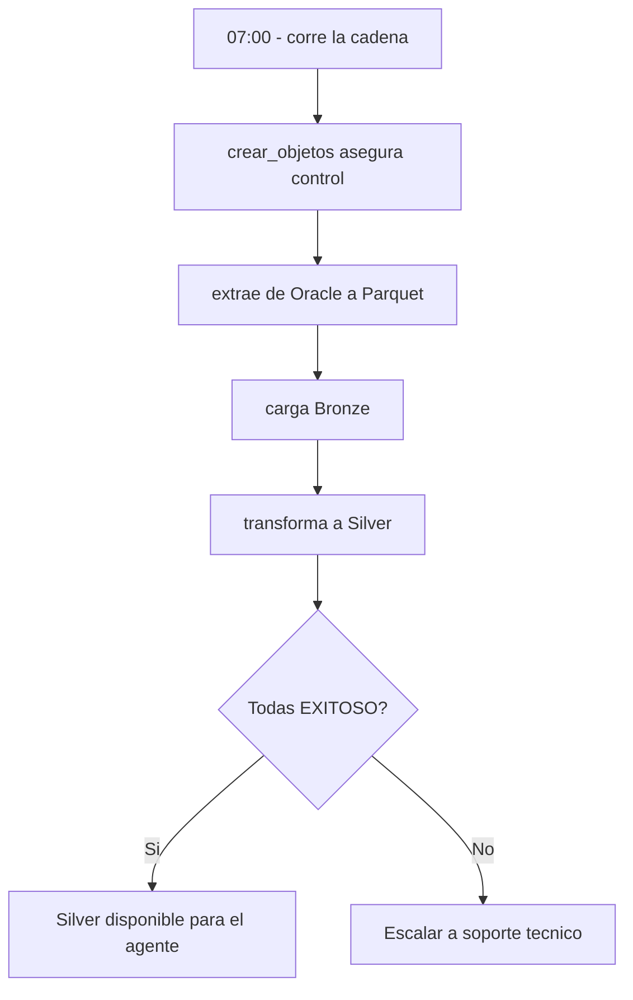

# Manual de usuario

## Objetivo
Explicar `midas_data_platform` a una persona que lo consulta u opera funcionalmente, sin
exigir conocimiento profundo de Databricks. Este bundle es de **datos**: prepara la
informacion que luego usa el agente MIDAS. No toma decisiones de negocio.

## 1. Que hace
Todos los dias trae desde Oracle la informacion de facturacion necesaria para analizar
ordenes de calidad, la organiza en capas de datos y deja listas las tablas **Silver** que
consume el agente. En concreto:
- extrae 8 conjuntos de datos (ordenes, productos, lecturas, consumos, criticas,
  comentarios, cuentas de cobro, cargos)
- los deja limpios y tipados en tablas **Bronze**
- los combina/enriquece en tablas **Silver**

## 2. Que entra al sistema
Datos operativos de Oracle. No hay entrada manual por usuario: el proceso es automatico y
programado.

## 3. Que entrega el sistema
Tablas de datos en Databricks (schema `facturacion`):
- 12 tablas **Bronze** (`*_bronze`)
- 13 objetos **Silver** (`*_silver`): 8 tablas y 5 vistas. Incluyen el historial de
  facturacion y de critica del Caso 1, y el historial de consumo, los cargos y las
  features del Caso 2

No entrega decisiones, ni CSV, ni predicciones: eso es del bundle del agente.

## 4. Como saber si "corrio bien"
Cada corrida deja una bitacora en la tabla `midas_log_cargas`. Una corrida sana muestra las
8 cargas en estado `EXITOSO` para el dia. Si alguna aparece `FALLIDO`, hay un mensaje de
error asociado que el equipo tecnico interpreta.

## 5. Frecuencia de ejecucion
- La cadena corre **diariamente a las 07:00** hora Bogota (activa en uat/pdn; pausada en dllo).
- Existe un chequeo de conectividad a Oracle que se ejecuta a demanda cuando se sospecha un
  problema de red o credenciales.

## 6. Donde ver resultados
- Tablas Bronze y Silver en el catalogo del ambiente, schema `facturacion`.
- Estado de la corrida: tabla `midas_log_cargas`.

## 7. Que puede hacer un usuario funcional
- consultar las tablas Silver para analisis
- revisar en `midas_log_cargas` si la carga del dia fue exitosa
- escalar al equipo tecnico si una carga falla o falta

## 8. Que no debe hacer un usuario funcional
- cambiar credenciales, variables o el jar del Volume
- desplegar codigo sin acompañamiento tecnico
- hacer `bundle destroy`: las tablas de control son compartidas con otro bundle

## 9. Flujo de uso recomendado

## 10. Cuando escalar
Escalar si:
- una o mas cargas del dia quedan en `FALLIDO`
- la cadena no corre o no termina
- faltan tablas Bronze/Silver esperadas
- el chequeo de conectividad a Oracle falla

## 11. FAQ funcional

### Este bundle decide si una orden tiene ajuste?
No. Solo prepara los datos. La decision (con/sin ajuste, investigacion manual) es del
bundle del agente `midas_agent`.

### Por que a veces falla la conexion a Oracle sin cambiar nada?
Suele ser un tema de red/firewall entre Databricks y Oracle, no de credenciales. El equipo
tecnico lo confirma con el job de chequeo de conectividad.

### Si falla una carga, se pierden los datos del dia anterior?
No necesariamente: Bronze se sobreescribe por carga; si un dia falla, queda registrado en la
bitacora y se puede reejecutar.

## 12. Autocritica funcional
- El bundle es entendible para operacion, pero no tiene interfaz de usuario dedicada.
- La lectura de resultados depende de saber consultar tablas en Databricks.
- Para negocio, el valor esta en tener datos frescos y trazables cada dia, no en una salida directa.
